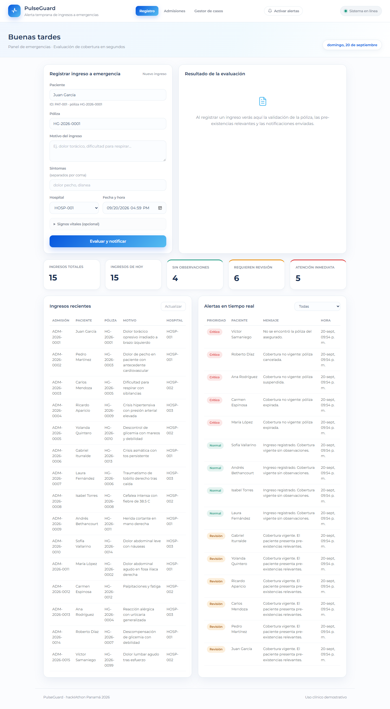
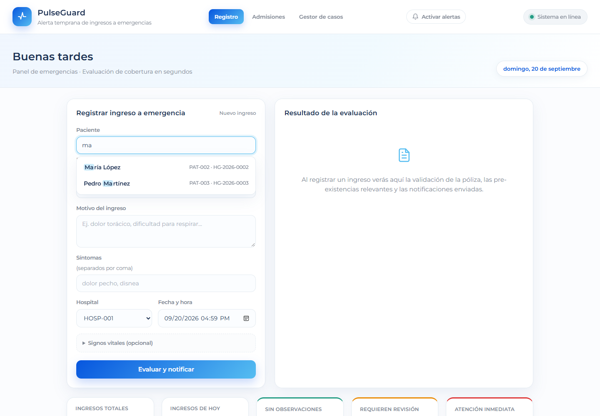
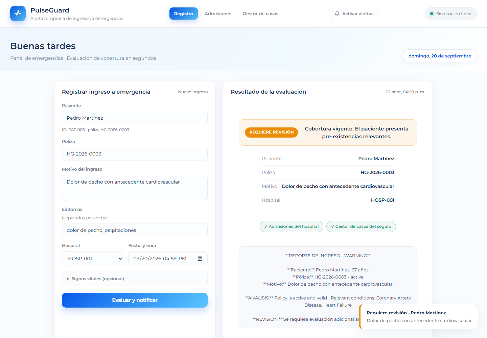
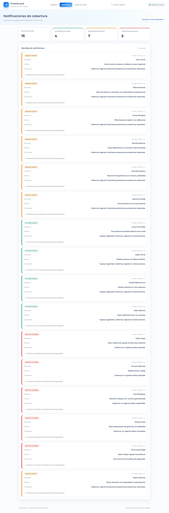
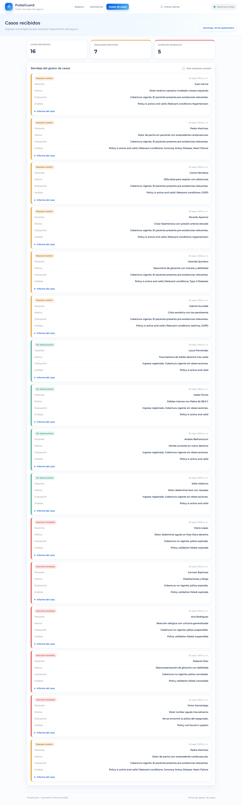

<p align="center">
  
</p>

<h1 align="center">PulseGuard</h1>

<p align="center">
  <b>Sistema de Alerta Temprana de Ingresos a Emergencias</b><br/>
  Cuando un asegurado entra a urgencias, hospital y aseguradora lo saben al instante.
</p>

<p align="center">
  
  
  
  
  
  
</p>

<p align="center">
  <a href="https://pulseguard.sweetcode.studio"><b>Demo en vivo</b></a> ·
  <a href="https://pulseguard.sweetcode.studio/docs">API Docs</a> ·
  <a href="docs/HERRAMIENTAS-IA.pdf">Herramientas de IA (PDF)</a>
</p>

---

## ¿Qué es?

**Reto 4 — hackIAthon Panamá 2026.** Un **webhook** se activa cuando un asegurado ingresa a
la emergencia de un hospital. Un **agente** valida **instantáneamente** la vigencia de la
póliza y el historial de pre-existencias, y envía una **notificación simultánea** al
departamento de admisiones del hospital y al gestor de casos del seguro — con un panel en
**tiempo real** para ambos.

> **Diseño clave:** la lógica crítica (cobertura y pre-existencias) es **determinista**
> (PostgreSQL + Python). La IA **solo redacta** el informe; nunca decide cobertura.

## Cómo funciona

1. El hospital registra el ingreso; su sistema llama al **webhook** (`POST /api/v1/webhook/admission`).
2. La API guarda el ingreso en **PostgreSQL** y ejecuta el agente.
3. El agente valida la **póliza** (estado y fechas) y cruza las **pre-existencias** con el motivo — decisión determinista.
4. La **IA** redacta el informe clínico (o usa una plantilla local si no hay API key).
5. **Notificación simultánea** a admisiones del hospital y al gestor de casos del seguro.
6. El resultado se emite por **WebSocket** y los tres portales se actualizan en vivo.
7. Todo queda **auditado** para trazabilidad.

## Capturas

**1. Registro del ingreso a emergencia** — el personal de admisiones registra al paciente; el sistema valida la cobertura y dispara la notificación automáticamente.



**2. Autocompletado de asegurados** — al escribir aparecen los pacientes registrados (nombre · póliza); también se permite ingresar un paciente nuevo.



**3. Resultado de la evaluación** — nivel de alerta, pre-existencias relevantes, notificaciones enviadas y el informe generado por IA.



**4. Admisiones del hospital** — bandeja en tiempo real con cada ingreso notificado y su estado de cobertura.



**5. Gestor de casos del seguro** — casos priorizados con el análisis y el informe del caso para su revisión.



## Arquitectura

```
Hospital registra al paciente
        │  (webhook, automático)
        ▼
┌──────────────────────────────────────────────┐
│  PulseGuard (FastAPI)                         │
│  1. Guarda el ingreso en PostgreSQL           │
│  2. AGENTE (determinista):                    │
│       • ¿póliza vigente?  (estado + fechas)   │
│       • ¿pre-existencias relevantes?          │
│  3. IA: redacta el informe clínico            │
│     (si no hay API key, usa plantilla local)  │
└───────────────┬──────────────────────────────┘
                │  en el mismo instante
      ┌─────────┴──────────┐
      ▼                    ▼
Admisiones del        Gestor de casos
hospital              del seguro
      └─────────┬──────────┘
                ▼
     WebSocket → los 3 portales en vivo
```

## Niveles de alerta

| Nivel | Cuándo |
|---|---|
| 🟢 Sin observaciones | Póliza vigente, sin pre-existencias relevantes |
| 🟡 Requiere revisión | Póliza vigente **con** pre-existencias relevantes |
| 🔴 Atención inmediata | Póliza inexistente, expirada, suspendida o cancelada |

> "Atención inmediata" **no** niega la atención: en urgencias el paciente siempre se atiende.
> La alerta es para que administración y seguro resuelvan la cobertura de inmediato.

## Stack

| Capa | Tecnología |
|------|------------|
| API / Webhook | FastAPI + Uvicorn |
| Base de datos | PostgreSQL 16 + SQLAlchemy + Alembic |
| IA | OpenRouter (modelo configurable) con *fallback* determinista |
| Tiempo real | WebSocket nativo (`/api/v1/ws/alerts`) |
| Frontend | HTML + CSS + JS (sin frameworks ni dependencias externas) |
| Proxy / Deploy | nginx + Docker Compose + Cloudflare Tunnel |

## API

| Método | Ruta | Descripción |
|--------|------|-------------|
| `POST` | `/api/v1/webhook/admission` | Recibe el ingreso y dispara el agente |
| `GET` | `/api/v1/admissions` | Listado de admisiones |
| `GET` | `/api/v1/admissions/{id}` | Detalle + alertas |
| `GET` | `/api/v1/alerts` | Alertas (filtro `?level=`) |
| `GET` | `/api/v1/alerts/stats` | KPIs |
| `WS` | `/api/v1/ws/alerts` | Canal en tiempo real |
| `GET` | `/health` | Estado de la API y la base de datos |

<details>
<summary>Ejemplo de petición</summary>

```bash
curl -X POST https://pulseguard.sweetcode.studio/api/v1/webhook/admission \
  -H "Content-Type: application/json" \
  -d '{
    "admission_id": "ADM-001",
    "patient_id": "PAT-001",
    "policy_number": "POL-2024-001",
    "timestamp": "2026-09-20T05:00:00",
    "admission_reason": "Chest pain",
    "symptoms": ["chest pain", "dyspnea"],
    "hospital_code": "HOSP-001"
  }'
```
</details>

## Ejecución local

```bash
cp .env.example .env          # ajusta POSTGRES_PASSWORD y OPENROUTER_API_KEY
docker compose up -d --build  # stack en http://localhost:8080
```

### Redespliegue en el servidor

```bash
./deploy.sh
```

## Estructura

```
src/
  api/            FastAPI: rutas, esquemas
    routes/       admissions, alerts, dashboard, ws (WebSocket)
  core/           realtime.py (hub WebSocket)
  models/         SQLAlchemy (patients, policies, pre_existences, admissions, alerts, audit_logs)
  services/       policy, patient, alert, notification, ai
  agent/engine.py Orquestador determinista
  receivers/      Mocks hospital / aseguradora
web/              Frontend estático (3 portales)
deploy/nginx/     Reverse proxy
data/seed.sql     Esquema + datos de prueba
```

## Equipo

<table>
  <tr>
    <td align="center" width="50%">
      <br/>
      <b>Daniel Valdés</b><br/>
      <sub>Desarrollo · Infraestructura · Seguridad</sub><br/><br/>
      <a href="https://www.linkedin.com/in/daniel--valdes">LinkedIn</a> ·
      <a href="https://github.com/danielvaldess">GitHub</a>
    </td>
    <td align="center" width="50%">
      <br/>
      <b>José C. Miranda</b><br/>
      <sub>Desarrollo de software · Datos</sub><br/><br/>
      <a href="https://www.linkedin.com/in/jos-mi-cast-300mm1500/">LinkedIn</a> ·
      <a href="https://github.com/josecmirandac15">GitHub</a>
    </td>
  </tr>
</table>

## Entregables hackIAthon

- **Repositorio:** este repo.
- **Agente en ejecución:** https://pulseguard.sweetcode.studio
- **Herramientas de IA:** [`docs/HERRAMIENTAS-IA.pdf`](docs/HERRAMIENTAS-IA.pdf) (fuente: [`docs/HERRAMIENTAS-IA.md`](docs/HERRAMIENTAS-IA.md))
